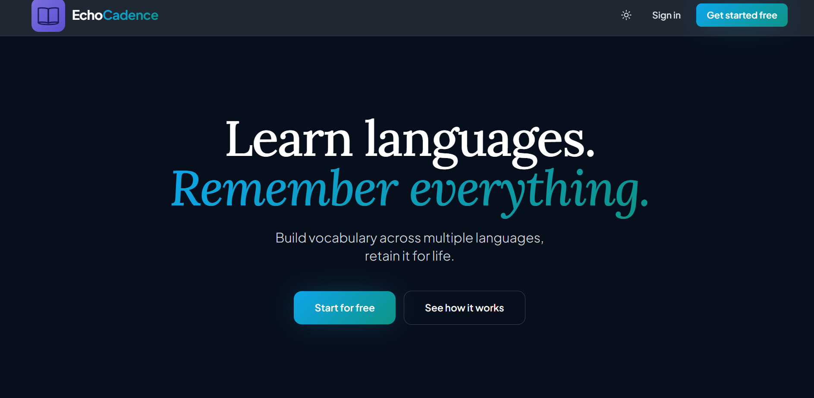

# EchoCadence

**Vocabulary learning that actually sticks.**

EchoCadence is a spaced repetition flashcard-based product for language learners. You build your vocabulary list, study with flashcards, and the SM-2 algorithm handles the rest, scheduling each word to come back exactly when you're about to forget it.

🔗 **Check it out here:** [echocadence.vercel.app](https://echocadence.vercel.app) 

📁 **Repo:** [github.com/Divya4879/EchoCadence](https://github.com/Divya4879/EchoCadence)

---

## Why EchoCadence

Most vocabulary apps either dump everything on you at once or make you manually decide what to review. EchoCadence does neither. You add words, you study, and the algorithm figures out the optimal time to bring each card back, based on how hard it was for you specifically.

The result: less time reviewing things you already know, more time on things you don't.

---

## Features

### Vocabulary Management
- Up to **5 languages** with fully isolated workspaces
- **6 built-in categories** per language: Words & Meanings, Synonyms, Antonyms, Phrases, Slangs & Meanings, Grammar Rules
- Up to **3 custom categories** - define your own field labels (e.g. Kanji / Reading, Verb / Conjugation)
- Full CRUD on all entries - add, edit, delete
- **Filter entries by status** directly in the vocabulary list: All, Learn (not yet studied), Revise (already rated)
- **Inline difficulty tag editing** - change a card's Easy / Medium / Hard rating directly from the word list without going through a flashcard session

### Flashcard Sessions
- **Learn mode** - only shows cards you haven't studied yet
- **Revise mode** - only shows cards due for review today based on your schedule
- Sessions launched directly from each language page, pre-filtered to that language
- Flip animation with keyboard-friendly interaction
- "Got it / Not quite" feedback per card
- Missed cards get one retry pass at the end of the session
- First-attempt correct answers tracked and highlighted (🥳)

### Spaced Repetition (SM-2)
- Every card has its own independent review schedule
- Hard cards return sooner; easy cards give you longer breathing room
- Customizable intervals: same-day, end-of-day, weekly, monthly
- Schedule visible and editable from the Progress page

### Progress & Stats
- **Weekly summary**: words learned this week, reviews completed, total mastered vs total cards
- Per-card view filtered by difficulty: Easy, Medium, Hard, Not rated
- Next review date shown per card (Due now / In Xh / Tomorrow / In X days)
- First-attempt success rate tracked
- Only shows cards you've actually attempted — not your full unstarted list

### Auth & Sessions
- Sign in with **Google** or **email/password**
- Username set on first login
- **15-minute inactivity logout** - session ends automatically after idle time
- New deployments invalidate sessions - users are always on the latest version

---

## Tech Stack

| Layer | Technology |
|-------|-----------|
| Frontend | React 18, Vite, Tailwind CSS |
| API | Node.js, Express (Vercel Serverless Functions) |
| Database | TimescaleDB on Tiger Cloud (PostgreSQL) |
| Auth | Auth0 (Google + email/password) |
| Deployment | Vercel |

### Database architecture
- `card_reviews` - **TimescaleDB hypertable**, time-partitioned for efficient querying at scale
- `daily_review_stats` - **continuous aggregate** pre-computing daily review totals per user
- `card_schedule` - per-card SM-2 state (interval, ease factor, next review date)
- `card_attempts` - raw attempt log for first-attempt tracking
